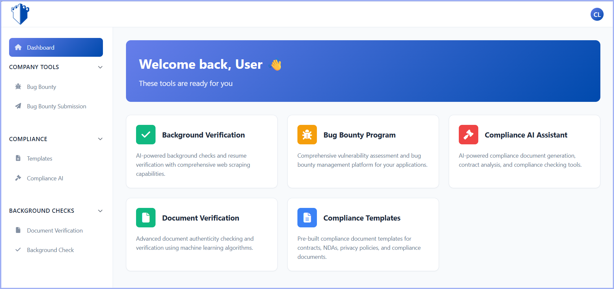

# Cyber Posture

A Django-based cybersecurity posture management application.

## Screenshots

### Dashboard


### Bug Bounty Module


## Prerequisites

Before installing, ensure you have the following installed on your system:

- **Python 3.8+** - [Download Python](https://www.python.org/downloads/)
- **pip** - Python package installer (usually comes with Python)
- **Git** - [Download Git](https://git-scm.com/downloads)

To verify installations, run:
```bash
python --version
pip --version
git --version
```

## Installation

### 1. Clone the Repository

Download the project code to your local machine:
```bash
git clone https://github.com/Laja1233/Cyber-Posture
cd cyber_posture
```

**What this does:** Creates a local copy of the project in a folder called `cyber_posture` and navigates into it.

---

### 2. Create a Virtual Environment

A virtual environment isolates your project dependencies from other Python projects on your system.
```bash
python -m venv venv
```

**What this does:** Creates a folder called `venv` containing an isolated Python environment.

**Activate the virtual environment:**

- **On Windows:**
```bash
  venv\Scripts\activate
```

- **On macOS/Linux:**
```bash
  source venv/bin/activate
```

**How to verify:** Your terminal prompt should now show `(venv)` at the beginning.

---

### 3. Install Dependencies

Install all required Python packages listed in `requirements.txt`:
```bash
pip install -r requirements.txt
```

**What this does:** Downloads and installs Django and all other necessary libraries for the project.

**Common packages installed:**
- Django (web framework)
- Database drivers
- Security libraries
- Any other project-specific dependencies

---

---

### 4. Run Database Migrations

Set up the database structure:
```bash
python manage.py migrate
```

**What this does:** 
- Creates the SQLite database file (`db.sqlite3`)
- Sets up all necessary tables for Django and your apps
- Applies any database schema changes

**You should see output like:**
```
Running migrations:
  Applying contenttypes.0001_initial... OK
  Applying auth.0001_initial... OK
  ...
```

---

### 5. Create a Superuser (Admin Account)

Create an admin account to access the Django admin panel:
```bash
python manage.py createsuperuser
```

**What this does:** Prompts you to enter:
- Username
- Email address (optional)
- Password (enter twice for confirmation)

**Example:**
```
Username: admin
Email: admin@example.com
Password: ********
Password (again): ********
Superuser created successfully.
```

---


---

## Running the Application

Start the Django development server:
```bash
python manage.py runserver
```

**What this does:** Starts a local web server on your machine.

**You should see:**
```
Starting development server at http://127.0.0.1:8000/
Quit the server with CTRL-BREAK.
```

**Access the application:**
- Main site: `http://127.0.0.1:8000`
- Admin panel: `http://127.0.0.1:8000/admin`

**To stop the server:** Press `Ctrl+C` in the terminal.

---

## Troubleshooting

### Port Already in Use
If port 8000 is occupied, specify a different port:
```bash
python manage.py runserver 8080
```

### Migration Errors
If you encounter migration issues, try:
```bash
python manage.py makemigrations
python manage.py migrate
```

### Module Not Found Errors
Ensure your virtual environment is activated and dependencies are installed:
```bash
pip install -r requirements.txt
```

### Permission Errors (Linux/macOS)
You may need to use `python3` instead of `python`:
```bash
python3 manage.py runserver
```

---

## Project Structure
```
cyber_posture/
├── bug_bounty/          # Bug bounty management module
├── core/                # Core application logic and settings
├── static/              # Static files (CSS, JS, images)
├── staticfiles/         # Collected static files (production)
├── templates/           # HTML templates
├── screenshots/         # README screenshots
├── db.sqlite3          # SQLite database (created after migration)
├── manage.py           # Django management script
├── requirements.txt    # Python dependencies
└── README.md          # This file
```

---

## Common Commands
```bash
# Activate virtual environment
source venv/bin/activate  # macOS/Linux
venv\Scripts\activate     # Windows

# Run development server
python manage.py runserver

# Create migrations (after model changes)
python manage.py makemigrations

# Apply migrations
python manage.py migrate

# Create superuser
python manage.py createsuperuser

# Open Python shell with Django context
python manage.py shell

# Run tests
python manage.py test
```

---

## Requirements

See `requirements.txt` for full list of dependencies.

**Main dependencies:**
- Django 4.x+
- SQLite3 (included with Python)

---


## Contributing

1. Fork the repository
2. Create a feature branch (`git checkout -b feature/YourFeature`)
3. Commit changes (`git commit -m 'Add some feature'`)
4. Push to branch (`git push origin feature/YourFeature`)
5. Open a Pull Request

---

## Support

For issues or questions, please open an issue on GitHub or contact embolue@gmail.com